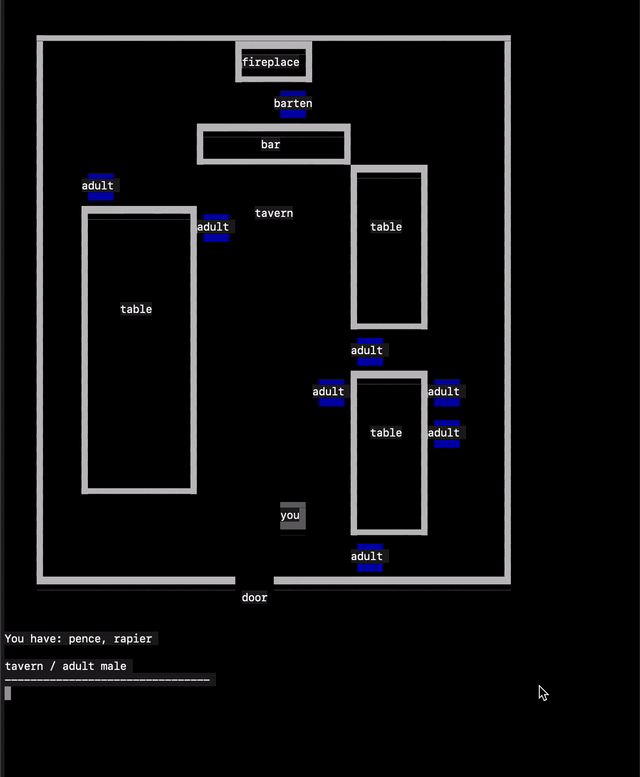

llama-journey
=============



This is a little experimental adventure game that features rooms, items, and characters generated on
the fly by [Llama](https://ai.meta.com/llama/), running locally via
[llama.cpp](https://github.com/ggerganov/llama.cpp). It renders with `curses` in the terminal.

**The game is functional but unfinished.** Many features, for example player stats and combat,
remembering the map or storyline, have not been implemented. Also, the model may generate subpar
experiences, like repeated scenes or rooms without exits. It may take a few
restarts to get a good experience.

Also, model outputs are evaluated in Python in a not-totally-safe way. **Do not use in production or
with untrusted models**. Basic efforts are taken to avoid accidental unintended code evaluation, but
it's not hardened against attacks.

Installation
------------

To play, you will need to clone and build [llama.cpp](https://github.com/ggerganov/llama.cpp):
```
$ git clone https://github.com/ggerganov/llama.cpp /some/path/llama.cpp
$ cd /some/path/llama.cpp
$ make
```

Then, make sure you have the [Llama model weights](https://ai.meta.com/llama/) in llama.cpp's
[GGUF](https://github.com/ggerganov/llama.cpp#prepare-data--run) format. If you have the original
model weights from Meta, follow the directions from llama.cpp:
```
$ cd /path/to/llama.cpp
$ python3 -m pip install -r requirements.txt
$ python3 convert.py /path/to/llama-2-13b # etc
$ ./quantize /path/to/llama-2-13b/ggml-model-f16.gguf /path/to/llama-2/13b/ggml-model-q4_k_m.gguf Q4_K_M
```

Then run `game.py` in this repository with the `main` binary from `llama.cpp` along with the model
weights in GGUF format:
```
python3 game.py /path/to/llama.cpp/main /path/to/llama-2-13b/ggml-model-q4_k_m.gguf prompt.txt
```

The game was primarily tested on a Mac M2 Max with Llama 2 13B quantized at Q4_K_M.

First Steps
-----------

Once you get the game running, try ordering an ale from the bartender:

1. <kbd>Up</kbd> to move close to the bartender
1. <kbd>1</kbd> to equip pence
1. <kbd>g</kbd> to give the pence

Depending on the reaction, ask for an ale:

1. <kbd>t</kbd> to talk
1. type "one ale please" <kbd>Enter</kbd>

Next Steps
----------

* explore the world by walking out a door and hitting <kbd>Enter</kbd>
* generate a new world by using the game console:
  1. <kbd>~</kbd> to activate console
  1. type "newgame Deep Space" (or whatever) then <kbd>Enter</kbd>

Troubleshooting
---------------

* If Llama generates an empty room, you can use the console to generate doors or people (or just
  restart):
  1. <kbd>~</kbd> to activate console
  1. type, e.g., "newdoor cellar_door &lt;description>" or "newperson amy &lt;description>" then <kbd>Enter</kbd>


--------

Copyright © 2023 Evan Jones
